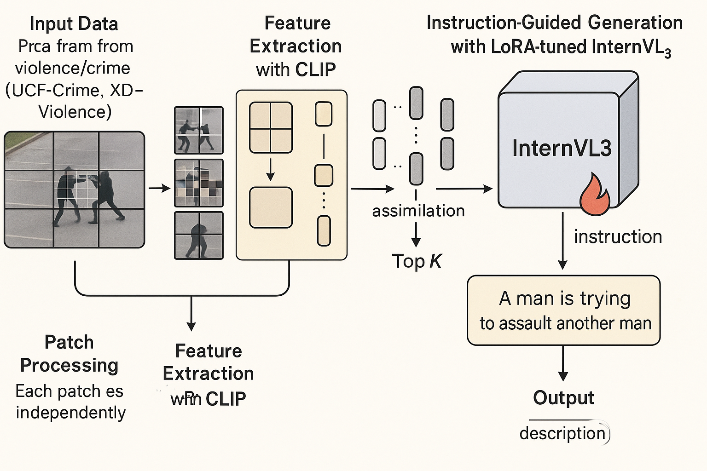

# **铸造AI“天眼”：基于InternVL的视频异常检测大模型，守护城市安全**

在熙熙攘攘的城市脉搏中，潜藏着难以预见的异常脉动。从转瞬即逝的街头骚乱到悄然发生的暴力事件，传统的监控系统往往在海量视频中“视而不见”。我们如何能让冰冷的摄像头拥有洞察秋毫的智慧，在危机萌芽之际便发出预警？

本项目——**“基于InternVL的视频异常检测大模型”**，正是为此而生。我们旨在打造一个全天候、高精度的AI“数字哨兵”，以前所未有的方式赋能公共安全，为预防犯罪提供坚实的技术支撑。

本项目的架构图如下所示

## **核心引擎：强大的InternVL视觉大模型 🧠**

我们的“哨兵”拥有一个超凡的“大脑”——**InternVL**。作为业界领先的视觉-语言大模型，InternVL不仅能“看懂”图像，更能“理解”视频中复杂的动态场景和行为交互。它强大的视觉表征能力，是我们识别异常事件的基石。

## **精准“教练”：HAIC数据集的深度微调 🎯**

为了让这位“哨兵”精通“十八般武艺”，我们选用**HAIC（Hant-tech Anomaly & Illegal-parking Classification）数据集**对其进行专项“特训”。HAIC数据集包含了丰富的真实世界异常行为和特定场景数据，通过在其上进行精细微调，我们能够教会InternVL模型精准识别出视频画面中那些稍纵即逝的“不和谐音符”——无论是异常的徘徊、突然的追逐，还是潜在的暴力冲突。

## **实战“考场”：挑战UCF-Crime与XD-Violence ⚔️**

“学成”之后，我们的模型将在两大国际公认的“高难度考场”——**UCF-Crime**和**XD-Violence**数据集上进行终极考验。

* **UCF-Crime**：汇集了大量真实的犯罪视频片段，考验模型在真实、嘈杂环境下捕捉犯罪行为的能力。
* **XD-Violence**：则包含了从电影、监控等多种来源截取的暴力场景，数据跨度极大，对模型的泛化能力提出了极致挑战。

通过在这两大权威数据集上的严苛分析与验证，我们将充分证明我们模型的卓越性能与现实世界的应用价值。

## **最终愿景：以AI之光，照亮平安之路 ✨**

我们坚信，技术应服务于人，服务于社会。本项目不仅仅是一次技术的探索，更是一份对公共安全的承诺。通过构建这个先进的视频异常检测大模型，我们希望能够：

* **赋能智慧城市**：为城市安防系统植入智能核心，实现从“被动查看”到“主动预警”的跨越。
* **减轻安保压力**：将安保人员从繁杂的屏幕监控中解放出来，聚焦于高危事件的快速响应。
* **助力犯罪预防**：通过对异常行为的早期识别，为执法部门提供宝贵的时间窗口，有效遏制犯罪的发生。